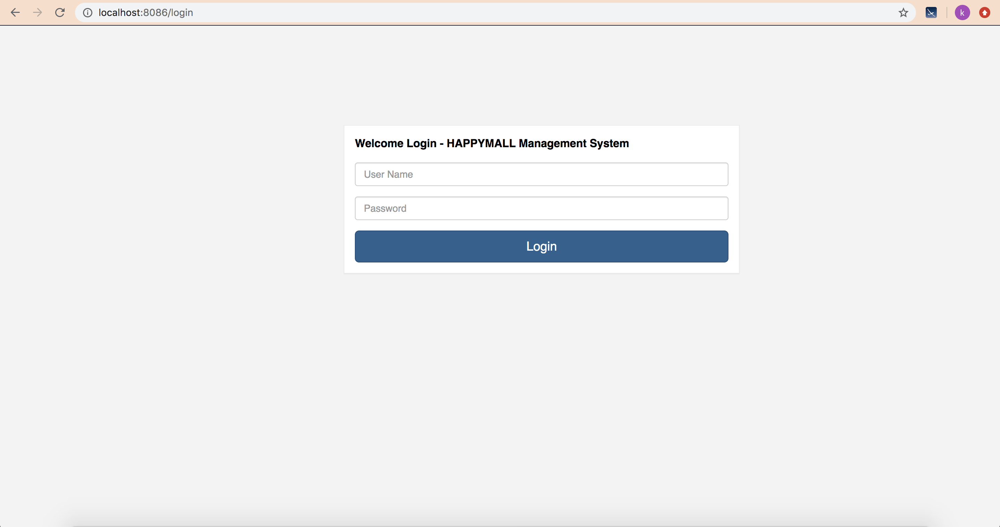
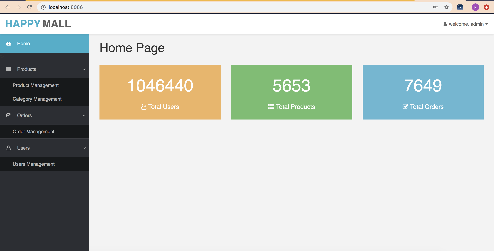
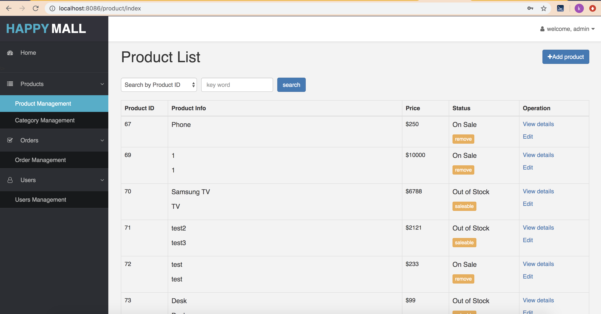
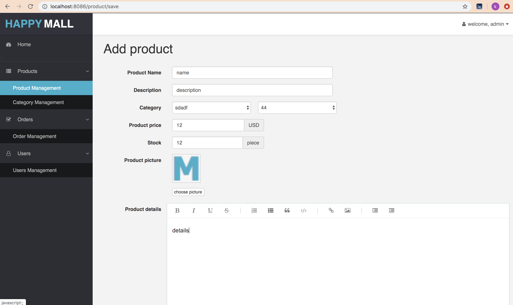

#E-Commerce Management System (Admin-side)

## Requirement Analysis

1. Project description:

   This project is a E-commerce management system which is designed for administrator especially. Such back-end management system should have several main functions: 1) Product Management. 2) Category Management. 3) Order Management. 4) Admin Login.

2. Main functions detail:

   * Product management: add/edit product, view product details, change product status between “on sale” and “out of stock”.

   * Category management: add category, view category and its parent/child category

   * Order management: view order list, view order detail, change order details between “paid” and “shipped”

   * User management: admin login, view user list.

3. System characteristic

   * Low adjustment costs and low compatibility requirements.

   * Low UI requirements but high development efficiency requirements.


## Main Technologies 

**React16** : Mainly use *Component State* to manage data in this project, utilize Virtual Dom to improve development efficiency. 

**React-Router4**: Use React-Router4 instead of React-Router3 to try dynamic routeing which comes into play when components are rendered, not through configuration in advance. When the application receives a request, it already knows which components to render. 

**Sass + Bootstrap**: Generate CSS file by using Sass which has variable and field.


## Demo Testing

**Login Page:**



**Home Page:**

Navigation bar is on the left side.




**Product Management:**

There is an *add* button on the right bottom, I will show the demo of that button later.

For each product, you have three operations: view, edit, change status.

(The other three pages(category management, order management, users management) are nealy same as this page in format and development process, just different in their specific functions and data management)



**Add Product:**




## Dependency & Run

The *package.json* shows all the packages this project needs.

Develop Tools:

* Yarn: A tool of package management. I used Yarn instead of NPM in this project which install package in a shorter time than NPM, and can do the integrity check.

* Webpack & Git

Run:

```
$ yarn run dev
```


